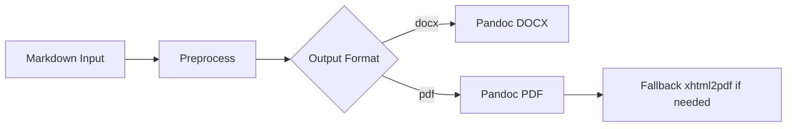
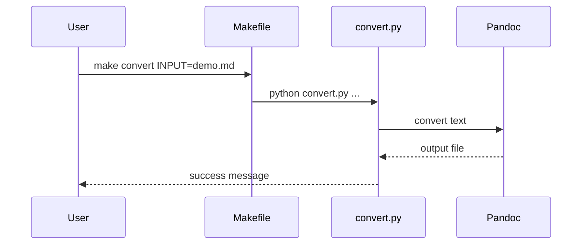
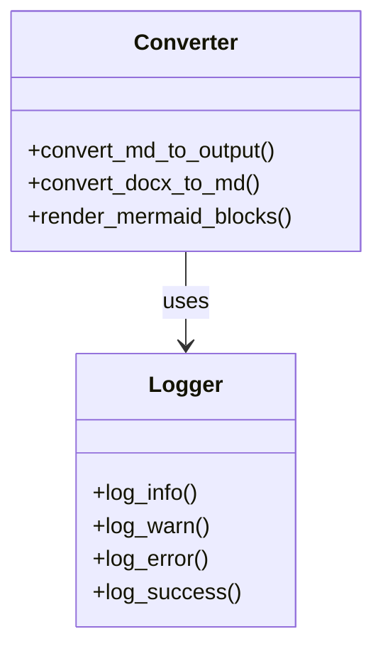

# Demo Markdown for Converter Testing

This document contains mixed Markdown features to validate DOCX and PDF conversion.

## 1) Plain Text and Formatting

This paragraph includes **bold**, *italic*, and `inline code`.

This sentence includes a manual line break.  
This line should appear directly below it.

## 2) Lists and Nested Lists

- Item A
- Item B
  - Item B.1
  - Item B.2
    - Item B.2.a
- Item C

1. Step one
2. Step two
3. Step three

## 3) Table

| Column | Type    | Notes                         |
|--------|---------|-------------------------------|
| id     | integer | Primary key                   |
| name   | text    | Display name                  |
| active | boolean | Defaults to `true` in samples |

## 4) Blockquote and Callout Style Content

> This is a blockquote.
> It spans multiple lines.
>
> - It can include list items.
> - It can include `inline code`.

## 5) Code Blocks

### 5.1 Python

```python
def summarize(items):
    return {
        "count": len(items),
        "first": items[0] if items else None,
    }


print(summarize(["alpha", "beta", "gamma"]))
```

### 5.2 JSON

```json
{
  "service": "md-converter",
  "version": "0.1.0",
  "features": ["docx", "pdf", "mermaid"]
}
```

### 5.3 Nested Fence Example (Literal Markdown)

````markdown
Here is a fenced block shown *as content*:

```bash
make convert INPUT=demo/demo.md FORMAT=pdf
```
````

## 6) Mermaid Diagrams

### 6.1 Flowchart



### 6.2 Sequence Diagram



### 6.3 Class Diagram



## 7) Horizontal Rule

---

## 8) Links and Image Placeholder

- Repository docs: <https://example.com/docs>
- Issue tracker: [Sample Issue Board](https://example.com/issues)

Image markdown example (path may or may not exist in your environment):


## 9) Escapes and Special Characters

Characters: \*literal asterisks\*, \_literal underscores\_, and backticks: \`

Math-like plain text: a^2 + b^2 = c^2

## 10) Final Checklist

- [x] Includes YAML front matter
- [x] Includes multiple Mermaid blocks
- [x] Includes nested fenced code example
- [x] Includes tables, lists, quotes, links, and image reference

